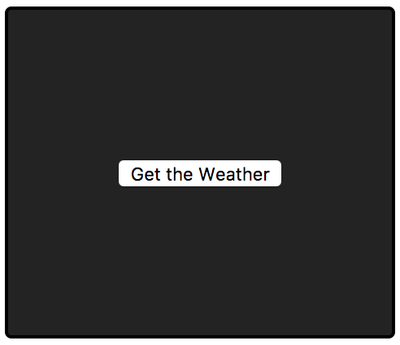
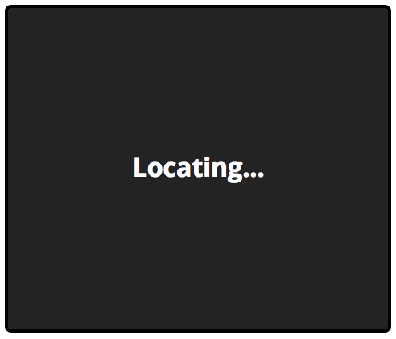
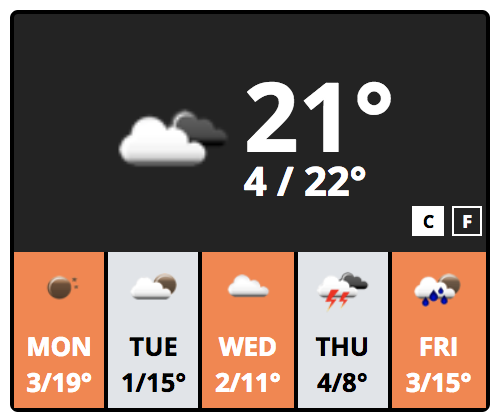
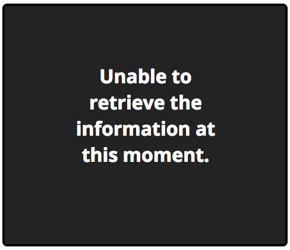
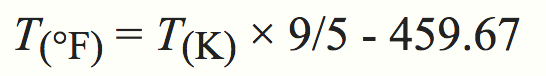
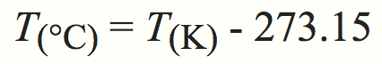

# Weather Conditions

## Prepare your environment 💻

Make sure your system meets the following requirements:

- node >= 8.9.3
- npm >= 5.5.1

## Launching 🚀

Install required packages:

```bash
$ npm install
```

Use the following command to run the app:

```bash
$ npm run serve
```

## DOM Scripting

The requirements of this widget are:

**Spec**

1. It should display a button with the text *"Get the Weather"*.



2. When prompting for permission, hide the button and display the text
   *"Locating..."* instead.



3. When permission is given, it should display the current weather.



4. If something went wrong (i.e. permission is not given) then display the text
   *"Unable to retrieve the information at this moment"*.



5. Please notice the "C" and "F" buttons at the bottom right corner. 👀

## AJAX

**Spec**

1. Get your current location using the geolocation API available in your
   browser.
2. Please use [https://openweathermap.org/api](https://openweathermap.org/api)
   to get the current weather at your location.
3. Do not forget to add the icon matching with the current weather! The payload
   includes the icon name to use
   .🌤 

## More JS

Give functionality to the temperature unit buttons! 🌡

On click, change temperature of given unit. Furthermore, See in the mock when
"C" is selected.

`OpenWeatherAPI` returns the temperature in Kevin degrees, you need to convert
between units. Here are the formulas (thanks `Wikipedia`):

To convert from Kelvin to F:



To convert from Kelvin to C:



## HTML & CSS

The layout is pretty simple. You don't need any css library, right? 😉 

Remember that we should not be able to distinguish between the mock and your
final result.

**Spec**

1. Weather icon and temperature text should be centered both horizontally and
   vertically.
2. min/max temperatures should start at the same level than the temperature
   text.
3. Forecast should have five squares with following days (might be hardcoded).
4. Forecast odd-numbered items should have dark background color.
5. Forecast even-numbered items should have light background color.

The font used is [*Open
Sans*](https://fonts.googleapis.com/css?family=Open+Sans:700)

Here the vars we recommend you to use, `this is not required though`:

```scss
$font-family: "Open Sans", sans-serif;
$display-background-color: #000;
$forecast-background-color: #FF8143;
$forecast-background-color-secondary: #E0E4E8;
```

## Unit Testing

1. Test the computation method to convert from K to C.
2. Test the computation method to convert from K to F.
3. **Bonus:** Test button actions.

Cat tax:

[kitty animation](https://i.imgur.com/qUse4Ue.gif)
